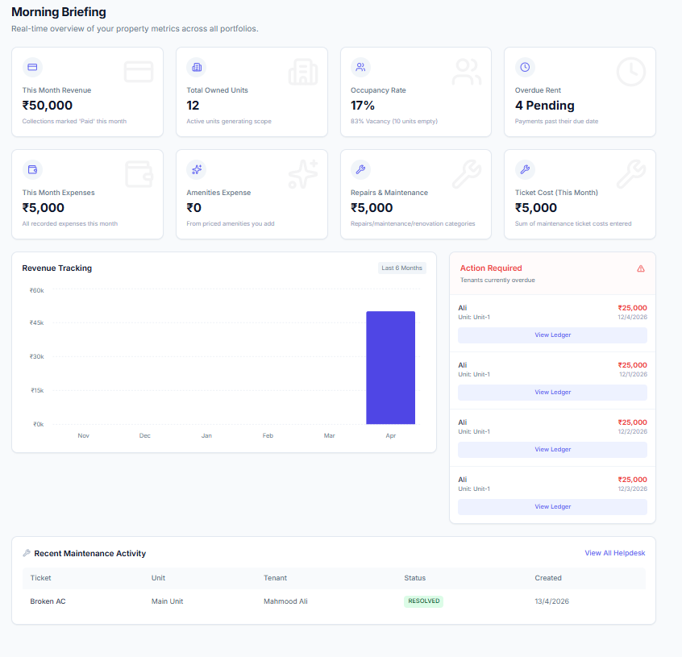
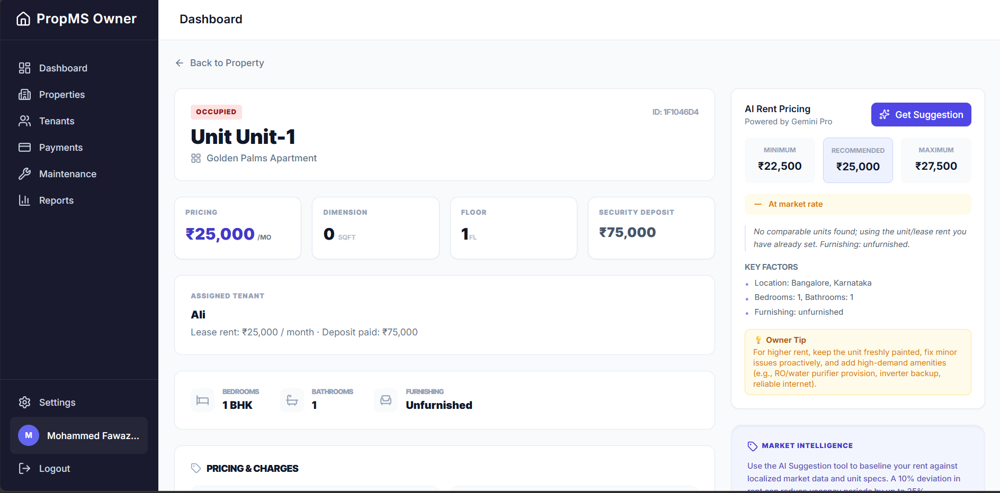

! `!}{  <div align="center">


# PropMS — Property Management Platform

**A full-stack, AI-powered property management platform for landlords and tenants.**  
Automate rent collection, maintenance, leases, expenses, and get Gemini AI insights — all in one place.

[](https://react.dev)
[](https://nodejs.org)
[](https://postgresql.org)
[](https://prisma.io)
[](https://tailwindcss.com)
[](https://razorpay.com)

[Features](#-features) · [Tech Stack](#-tech-stack) · [Getting Started](#-getting-started) · [Screenshots](#-screenshots) · [API Docs](#-api-overview) · [Contributing](#-contributing)

</div>

---

## 📌 Overview

PropMS is a production-grade property management system built for the Indian rental market. It serves two types of users:

- **Owners / Landlords** — manage properties, units, tenants, payments, expenses, and maintenance from a unified dashboard
- **Tenants** — pay rent online, raise repair tickets, view lease, download receipts, and message the owner

The platform is fully automated — rent bills generate monthly, overdue payments are flagged daily, notifications go out via email and WhatsApp, and an AI engine powered by Google Gemini provides rent pricing suggestions, tenant risk scores, and predictive maintenance alerts.


---

## ✨ Features

### For Owners
| Feature | Description |
|---|---|
| Multi-property management | Add unlimited properties and units with full CRUD |
| Tenant onboarding | Add tenants, assign units, auto-send login credentials |
| Automated billing engine | Rent bills auto-generate monthly via cron job |
| Payment tracking | Track pending, paid, overdue, and partial payments |
| Manual payment marking | Mark cash payments as paid with method and date |
| Razorpay integration | Online UPI, card, and netbanking payments |
| Maintenance ticketing | Full ticket lifecycle |
| Expense auto-logging | Ticket resolution cost auto-logs as property expense |
| Lease management | Digital leases with e-signature and PDF generation |
| Financial reports | P&L per property, expense breakdown, CSV export |
| AI rent pricing | Gemini-powered rent range suggestion per unit |
| AI predictive maintenance | Weekly pattern analysis with prevention recommendations |
| Dashboard analytics | Revenue charts, occupancy rates, KPI stat cards |

### For Tenants
| Feature | Description |
|---|---|
| Tenant portal | Dedicated dashboard separate from owner interface |
| Online rent payment | Pay via UPI, card, or netbanking through Razorpay |
| Payment history | View all receipts and past transactions |
| Maintenance requests | Raise tickets with photos and track resolution status |
| Lease access | Download signed lease agreement anytime |
| Notifications | Email and WhatsApp alerts for bills and updates |

---

## 🛠 Tech Stack

### Frontend
- **React 18** + **Vite** — fast development and build
- **React Router v6** — client-side routing
- **Tailwind CSS** — utility-first styling
- **TanStack React Query v5** — data fetching and caching
- **React Hook Form + Zod** — form handling and validation
- **Recharts** — dashboard charts and visualizations
- **Zustand** — auth state management
- **Lucide React** — icon library

### Backend
- **Node.js + Express** — REST API server
- **Prisma ORM** — type-safe database queries
- **PostgreSQL** (via Supabase) — primary database
- **JWT + bcrypt** — authentication and password hashing
- **Multer + Cloudinary** — file and image uploads
- **Nodemailer** — transactional email
- **node-cron** — scheduled background jobs
- **Razorpay** — payment gateway

### AI
- **Google Gemini 1.5 Pro** (`@google/generative-ai`) — AI features

### Infrastructure
- **Supabase** — hosted PostgreSQL database
- **Cloudinary** — media and document storage

---

## � Screenshots

### Owner Dashboard


### AI Pricing & Market Insights


### Property and Tenant Management
| Add Property | Add Tenant |
|---|---|
|  |  |
|  |  |

### Tenant Portal
| Tenant Login | Maintenance |
|---|---|
|  |  |

> More screenshots are included in the `Images/` folder for tenant workflows, payments, maintenance, and AI features.

---

## �📁 Project Structure

```
propms/
├── frontend/
│   ├── src/
│   │   ├── api/              # Axios API calls per resource
│   │   ├── components/
│   │   │   ├── ui/           # Button, Input, Modal, Badge, Table
│   │   │   ├── layout/       # Sidebar, Header, PageWrapper
│   │   │   └── shared/       # RentSuggestionCard, TenantRiskScore, etc.
│   │   ├── pages/
│   │   │   ├── auth/
│   │   │   ├── dashboard/
│   │   │   ├── properties/
│   │   │   ├── units/
│   │   │   ├── tenants/
│   │   │   ├── payments/
│   │   │   ├── tickets/
│   │   │   ├── leases/
│   │   │   ├── reports/
│   │   │   └── tenant-portal/
│   │   ├── hooks/
│   │   ├── store/
│   │   └── utils/
│   └── package.json
│
├── backend/
│   ├── src/
│   │   ├── routes/
│   │   ├── controllers/
│   │   ├── middleware/
│   │   ├── services/         # gemini, payment, notify, cron
│   │   └── utils/
│   ├── prisma/
│   │   └── schema.prisma
│   └── package.json
│
└── README.md
```


## 🔑 Environment Variables Reference

| Variable | Where to get it |
|---|---|
| `DATABASE_URL` | Supabase → Project Settings → Database → Connection string |
| `JWT_SECRET` | Any random long string (use a password generator) |
| `CLOUDINARY_*` | Cloudinary Dashboard → API Keys |
| `RAZORPAY_KEY_ID/SECRET` | Razorpay Dashboard → Settings → API Keys |
| `SMTP_USER/PASS` | Gmail → Google Account → App Passwords |
| `GEMINI_API_KEY` | [aistudio.google.com/app/apikey](https://aistudio.google.com/app/apikey) |

---

## 📡 API Overview

All endpoints are prefixed with `/api`. Authentication via `Authorization: Bearer <token>` header.

| Method | Endpoint | Description | Role |
|---|---|---|---|
| POST | `/auth/register` | Register owner account | Public |
| POST | `/auth/login` | Login, returns JWT | Public |
| GET | `/properties` | List owner's properties | Owner |
| POST | `/properties` | Create property | Owner |
| GET | `/properties/:id/units` | List units in property | Owner |
| POST | `/tenants` | Add tenant + create tenancy | Owner |
| GET | `/tenants/:id` | Tenant profile + history | Owner |
| GET | `/payments` | Payment list with filters | Owner |
| POST | `/payments/initiate` | Create Razorpay order | Tenant |
| POST | `/payments/webhook` | Razorpay payment confirmation | Razorpay |
| POST | `/tickets` | Raise maintenance ticket | Tenant |
| PATCH | `/tickets/:id` | Update ticket status | Owner |
| GET | `/dashboard` | Aggregated KPIs | Owner |
| POST | `/ai/rent-suggestion` | AI rent price range | Owner |
| POST | `/ai/tenant-risk` | AI tenant risk score | Owner |
| POST | `/ai/maintenance-insights` | AI maintenance predictions | Owner |

---

## 🤖 AI Features

PropMS uses **Google Gemini 1.5 Pro** for three AI-powered features:

### Rent Pricing Engine
Analyzes unit details (location, size, furnishing, amenities) alongside comparable units in your database and recommends a min/recommended/max rent range with market position and actionable tips.

### Predictive Maintenance
Analyzes ticket history patterns weekly to predict the top 5 issues likely in the next 60 days. Includes seasonal alerts, prevention costs vs. repair costs, and property health score.

---

## ⚙️ Background Jobs (Cron)

| Schedule | Job | Description |
|---|---|---|
| Daily at 9 AM | Rent reminder | Sends reminders for payments due in 7, 3, and 1 day |
| Daily at 9 AM | Overdue detection | Flags payments past due date as overdue |
| Daily | Lease expiry check | Alerts owners of leases expiring in 30 days |

---

## 🔐 Security

- Passwords hashed with **bcrypt** (salt rounds: 12)
- JWT tokens expire in 7 days
- All routes protected by role-based middleware — owners cannot access tenant data and vice versa
- Razorpay webhook signature verified before processing any payment
- File uploads validated for mime type and size (max 5MB)
- Rate limiting on auth routes (10 req/15 min) and AI routes (20 req/hour)
- `helmet` and `cors` configured on all Express routes

---

## 🗄️ Database Schema

Key tables:

- `users` — owners, tenants, vendors (role-based)
- `properties` — buildings owned by an owner
- `units` — individual rooms/flats within a property
- `tenancies` — links a tenant to a unit for a period (the central record)
- `payments` — every rent transaction, manual or online
- `maintenance_tickets` — repair requests with full lifecycle
- `expenses` — property costs for P&L reporting
- `inspections` — move-in/out checklists with photo evidence
- `messages` — per-tenancy chat history
- `notifications` — in-app alert feed
- `documents` — all uploaded files linked to any entity
- `maintenance_insights` — stored AI prediction results

---

## 📄 License

This project is licensed under the **MIT License** — see the [LICENSE](LICENSE) file for details.

---

## 👤 Author

Built by **Fawaz**  
Feel free to connect or raise issues on GitHub.

---

<div align="center">
<sub>Built with React, Node.js, PostgreSQL, and Google Gemini AI</sub>
</div>
